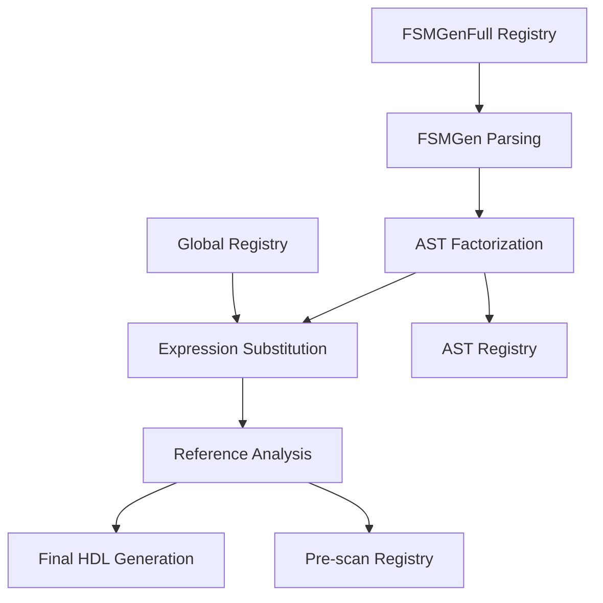

# FSM HDL Generator Development Notes

Technical insights, analysis, and enhancement ideas discovered during development.

---

## Deep Dive: Comprehensive Intermediate Signal Architecture

**Core Insight**: Dependency tracking requires complete information across multiple registries

### The Registry Ecosystem 🌳

**FSM HDL Generator uses four critical registries for intermediate signals:**

1. **AST Factorizer Registry** (`ast_factorizer->{intermediate_signals}`)
   - Results of AST-based factorization
   - Contains compound expressions with operator types
   - Maps structural patterns to signal names

2. **Global Expressions Registry** (`global_expressions`)
   - Cross-DT signal reuse tracking
   - Canonical expressions → intermediate names
   - Usage counts for optimization

3. **FSMGenFull Parsing Registry** (`fsm_module->signals`)
   - FSMGen-specific signals (like or_*)
   - Attributes-based classification
   - Complex signal object structures

4. **Pre-scan Referenced Registry** (`referenced_intermediate_signals`)
   - Signals needed in final HDL
   - Dependency collection phase
   - Declaration requirements

### Why Multiple Registries? 🤔

**Each registry serves a unique purpose in the pipeline:**



- **FSMGenFull**: Early-stage signal identification
- **AST Factorizer**: Expression optimization
- **Global Expressions**: Cross-cutting reuse
- **Pre-scan**: Final HDL requirements

### Signal Detection Architecture 🔍

**Key Methods**:

```perl
sub extract_intermediate_signals_from_expression($self, $expression) {
    my @intermediate_signals;
    
    # CRITICAL: Check ALL registries systematically
    for my $signal_name (@potential_signals) {
        # Check each registry path with proper fallbacks
        if ($self->check_ast_factorizer_registry($signal_name) ||
            $self->check_global_expressions_registry($signal_name) ||
            $self->check_fsmgen_registry($signal_name) ||
            $self->check_prescan_registry($signal_name)) {
            push @intermediate_signals, $signal_name;
        }
    }
    
    return @intermediate_signals;
}
```

**Robust FSMGenFull Signal Detection**:
```perl
sub check_fsmgen_registry($self, $signal_name) {
    my $signal = $self->get_signal_from_fsm_module($signal_name);
    return 0 unless $signal;
    
    # Multiple attribute access methods for robustness
    return (
        # Method 1: Attributes hash
        ($signal->can('attributes') && 
         $signal->attributes && 
         $signal->attributes->{is_intermediate}) ||
        # Method 2: get_attribute method
        ($signal->can('get_attribute') && 
         $signal->get_attribute('is_intermediate')) ||
        # Method 3: Direct hash access
        (ref($signal) eq 'HASH' && 
         exists $signal->{is_intermediate})
    );
}
```

### Dependency-Aware Filtering 🎯

**The Pipeline**:
1. **Collection**: Gather all signal references across registries
2. **Analysis**: Build complete dependency graph
3. **Rescue**: Keep signals referenced by kept signals
4. **Filter**: Remove truly unused signals

**Implementation Pattern**:
```perl
sub dependency_aware_filtering($self) {
    # Step 1: Build dependency map
    my %dependencies = $self->collect_all_dependencies();
    
    # Step 2: Initial filter
    my %initially_filtered = $self->apply_initial_filtering();
    
    # Step 3: Rescue referenced signals
    for my $kept_signal (keys %kept_signals) {
        for my $dependency (@{$dependencies{$kept_signal}}) {
            delete $initially_filtered{$dependency};
        }
    }
    
    # Step 4: Final filtered set
    return \%initially_filtered;
}
```

### Key Architecture Principles 🏗️

1. **Complete Information**
   - Check ALL registries for signals
   - Use multiple detection methods
   - Track signal source for debugging

2. **Robust Detection**
   - Graceful fallbacks for each registry
   - Handle varied signal object types
   - Debug logging for troubleshooting

3. **Dependency Awareness**
   - Build complete dependency graphs
   - Track cross-signal references
   - Rescue referenced signals

4. **Clean Pipeline**
   - Clear registry responsibilities
   - Systematic detection methods
   - Comprehensive validation

### Debugging Insights 🔧

**Common Issues & Solutions**:

1. **Missing Signals**
   - Check ALL registries
   - Trace registry population
   - Verify signal attributes

2. **Incorrect Filtering**
   - Validate dependency map
   - Check rescue logic
   - Trace signal sources

3. **Object Structure Variations**
   - Use multiple access methods
   - Add graceful fallbacks
   - Log access patterns

### Design Enhancement: Future Registry Unification 🎯

**Potential Improvement**: Single unified registry with multi-faceted classification

```perl
package FSM::HDL::SignalRegistry {
    has 'signals' => (
        is => 'ro',
        isa => 'HashRef[FSM::HDL::Signal]'
    );
    
    # Unified signal class
    package FSM::HDL::Signal {
        has 'sources' => (
            is => 'ro',
            isa => 'ArrayRef[Str]'  # AST, FSMGen, etc.
        );
        has 'attributes' => (
            is => 'ro',
            isa => 'HashRef'
        );
        has 'dependencies' => (
            is => 'ro',
            isa => 'ArrayRef[Str]'
        );
        # Additional properties...
    }
}
```

**Benefits**:
- Single source of truth
- Simplified dependency tracking
- Clearer signal lifecycle
- Better maintainability

This would require significant refactoring but could improve the long-term architecture.

### Key Insight: Complete Data Collection 🔑

The critical lesson from this fix: In complex systems with multiple data sources, complete information gathering is as important as correct logic.

**Best Practices**:
1. Track ALL information sources
2. Use multiple detection methods
3. Implement robust fallbacks
4. Add comprehensive debugging
5. Validate data completeness

---

## AST Type Detection and Operator Selection for SystemVerilog

**Key Discovery**: Intermediate signals require specialized classification for correct operator selection

### The Challenge: AST Type Recognition for Width Determination
**Problem**: Complex expressions with intermediate signals were generating incorrect operators
- Logical operators (`&&`, `||`) used instead of bitwise (`&`, `|`) 
- Root cause: `FSM::HDL::IntermediateSignalRef` AST types not recognized as single-bit
- Impact: Generated SystemVerilog failed synthesis due to wrong operator semantics

### Architecture: Enhanced AST Type Detection System
**Design Pattern**: Multi-layer classification with comprehensive debug logging

```perl
sub _operand_is_single_bit($self, $operand) {
    # Layer 1: AST type detection with debug tracing
    if (blessed($operand) && $operand->isa('FSM::HDL::IntermediateSignalRef')) {
        # Intermediate signals are always single-bit boolean
        return 1;
    }
    
    # Layer 2: Signal-based classification with heuristics
    my $signal_name = $self->extract_signal_name($operand);
    return $self->_signal_is_single_bit($signal_name);
}
```

### Critical Enhancement: Intermediate Signal Handling
**Recognition Strategy**:
1. **Explicit AST Type Check**: Handle `FSM::HDL::IntermediateSignalRef` as special case
2. **Always Single-bit**: Intermediate signals represent boolean conditions by design
3. **Force Bitwise**: Single-bit classification forces bitwise operator selection
4. **Fallback Heuristics**: Pattern matching for common single-bit signals (`*_en`, `*_wen`, `pready`, `rstn`)

### Debug Infrastructure Enhancement
**Comprehensive Logging System**:
- **Operand Classification**: Log every AST operand width determination step
- **Signal Analysis**: Trace signal lookup and heuristic application
- **Decision Reasoning**: Document why each signal classified as single/multi-bit
- **AST Structure**: Debug AST node types and method availability

### Design Benefits
✅ **Correct Operators**: All expressions use appropriate bitwise/logical operators  
✅ **Synthesis Ready**: Generated SystemVerilog compiles and synthesizes correctly  
✅ **Debug Visibility**: Comprehensive logging aids future troubleshooting  
✅ **Extensible**: Framework ready for additional AST types and heuristics

### Key Insight: AST Type Hierarchy Matters
**Principle**: Different AST node types require specialized handling
- **Regular SignalRef**: Use signal registry and heuristics for width determination
- **IntermediateSignalRef**: Always treat as single-bit boolean (design invariant)
- **Complex Expressions**: Recursive analysis of operands with proper type detection

**Implementation Pattern**: AST type detection must be the first step in width analysis to ensure correct classification path

---

## Register Feedback Architecture for Flop Assignments

**Key Insight**: `A <-` assignments require register feedback, not hardcoded defaults

### The Challenge: Multiplexer Default Value Semantics
**Problem**: Flop assignments losing state between clock cycles
```systemverilog
// WRONG: Hardcoded defaults
always_comb begin
  apb_ack = 1'b0;  // Register resets to 0 every cycle
  if (enable) apb_ack = 1;
end
```

**Root Cause**: Confusion between:
- **Default values** (multiplexer logic): Should maintain current state
- **Reset values** (initialization): Should use appropriate reset constants

### Architecture: Feedback-Based Multiplexer Design
**Correct Pattern**: Current register value as multiplexer default
```systemverilog
// CORRECT: Register feedback
always_comb begin
  apb_ack_next = apb_ack;  // Maintain current value
  if (enable) apb_ack_next = 1;  // Override when enabled
end

always_ff @(posedge clk or negedge rstn) begin
  if (!rstn) apb_ack <= 1'b0;  // Reset value
  else apb_ack <= apb_ack_next;  // Use multiplexer output
end
```

### Design Philosophy: Semantic Distinction
**Two Distinct Concepts**:
1. **`get_default_value()`**: For multiplexer logic (use feedback)
2. **`get_reset_value()`**: For initialization (use constants)

**Implementation Strategy**:
```perl
sub get_default_value($self, $lhs) {
    # For flop assignments, default = current register value
    if ($lhs eq 'next_state') {
        return "current_state";  # FSM state feedback
    }
    return $lhs;  # Generic register feedback
}

sub get_reset_value($self, $lhs) {
    # For initialization only
    return appropriate_reset_constant($lhs);
}
```

### Key Benefits
✅ **Proper Flop Behavior**: Registers maintain state as expected  
✅ **Synthesis Optimization**: Tools can optimize register feedback patterns  
✅ **Semantic Clarity**: Clear distinction between default and reset values  
✅ **State Machine Correctness**: FSM states persist correctly between transitions

### Critical Insight: Hardware Semantics in HDL Generation
**Principle**: HDL generators must understand hardware behavior semantics
- **Combinational Logic**: Outputs change immediately with inputs
- **Sequential Logic**: Outputs change on clock edges, maintain state between clocks
- **Multiplexers**: Default case should preserve current state for registers

**Design Guideline**: Always consider the hardware implementation when generating HDL constructs

---

## FSM Conditional Transition Parsing Architecture

**Key Discovery**: FSM transition conditions require sophisticated parsing beyond simple state names

### The Challenge: Conditional Suffixes in State Transitions
**FSM Specification Pattern**: Transitions can include conditional suffixes:
```lisp
(-> end_write <pwrite)     ; Transition to end_write IF pwrite is true
(-> end_read <!pwrite)     ; Transition to end_read IF pwrite is false
```

**Parser Challenge**: `parse_transition_new_format()` must handle both:
- Simple transitions: `(-> setup)` → Single element array `["setup"]`
- Conditional transitions: `(-> end_write <pwrite)` → Two element array `["end_write", "<pwrite"]`

### Architecture Enhancement: Multi-Element Transition Processing
**Design Pattern**: Extensible array-based transition representation
1. **Element 1**: Always the target state name
2. **Element 2+**: Optional condition suffixes, extensions, attributes

**Implementation Strategy**:
```perl
# Handle both formats seamlessly
my $target_state = $transition_array[0];  # Always present
my $condition_suffix = $transition_array[1];  # Optional

# Parse condition if present
if ($condition_suffix && $condition_suffix =~ /^<!?(.+)$/) {
    # Leverage existing parse_condition() infrastructure
    my $condition = $self->parse_condition($condition_suffix);
    # Wrap in conditional branch
    return $self->create_conditional_branch($condition, $action);
}
```

### Integration with Existing Infrastructure
**Leverage Existing Systems**: 
- **`parse_condition()`**: Handles `<signal`, `<!signal`, complex conditions
- **Conditional branches**: Existing AST creation for `if/else` logic  
- **Enable generation**: Automatic condition incorporation in enable signals

### Key Benefits
✅ **Backward Compatible**: Simple transitions continue to work unchanged  
✅ **Forward Compatible**: Framework ready for future conditional enhancements  
✅ **Consistent**: Uses same condition parsing as other FSM elements  
✅ **Maintainable**: Leverages existing conditional branch infrastructure

### Critical Insight: Enable Signal Differentiation
**The Real Impact**: Without conditional parsing, all conditional transitions generate identical enables:
- `setup_next_state_end_read_en = (setup_en && s_rst_n)` ❌ Missing `!pwrite`
- `setup_next_state_end_write_en = (setup_en && s_rst_n)` ❌ Missing `pwrite`

**With Conditional Parsing**: Proper differentiation:
- `setup_next_state_end_read_en = (setup_en && s_rst_n_and_not_pwrite)` ✅ 
- `setup_next_state_end_write_en = (setup_en && s_rst_n_and_pwrite)` ✅

**Design Principle**: Parser enhancements must propagate through entire generation pipeline to produce correct enable signals

---

## Multi-Pass AST Substitution System Design

**Key Insight**: Complex intermediate signal dependencies require iterative resolution

### The Challenge: Nested Intermediate Signal References
**Problem**: Intermediate signals can reference other intermediate signals, creating dependency chains:
- `s_rst_n_and_pready = (s_rst_n && pready)` 
- `s_rst_n_and_pready_and_not_apb_rq = (s_rst_n_and_pready && not_apb_rq)`

**Single-Pass Limitation**: Traditional substitution only handles one level of nesting

### Multi-Pass Solution Architecture
**Design**: Iterative substitution with convergence detection
1. **Phase 1**: Substitute in WEN/EN expressions (original expressions → intermediate signals)
2. **Phase 2**: Substitute in intermediate signal expressions themselves (NEW)
3. **Convergence Check**: Continue until no more substitutions occur
4. **Safety Limit**: Maximum 10 passes to prevent infinite loops

### Critical Edge Case: Self-Reference Prevention
**Problem Discovered**: Multi-pass substitution created invalid self-references:
```systemverilog
assign not_apb_rq = not_apb_rq;  // Invalid - signal references itself
```

**Root Cause**: When processing intermediate signal `not_apb_rq` definition containing `!apb_rq`, the substitution system would:
1. Recognize `!apb_rq` matches structural ID for `not_apb_rq`
2. Replace `!apb_rq` with `not_apb_rq` reference
3. Result in self-referencing assignment

**Solution**: **Context-Aware Substitution Prevention**
- Track `$current_signal_name` during substitution 
- Before any substitution, check if target signal matches current signal being processed
- Skip substitution if self-reference would occur
- Continue with recursive substitution of child expressions

### Implementation Pattern
```perl
# Enhanced method signature includes context
sub substitute_ast_recursively($ast, $structural_id_to_signal, $current_signal_name)

# Self-reference prevention check
if ($current_signal_name && $current_signal_name eq $signal_name) {
    # Skip substitution, preserve original expression
    return $ast;  # Continue with recursive processing instead
}
```

### Design Benefits
✅ **Handles Complex Dependencies**: Multi-level intermediate signal references work correctly  
✅ **Preserves Semantics**: Self-reference prevention maintains valid SystemVerilog  
✅ **Convergence Guarantee**: Iterative approach handles arbitrary nesting depth  
✅ **Debug Visibility**: Extensive logging tracks substitution decisions  
✅ **Robustness**: Safety limits prevent runaway substitution

### Key Lesson: Feature Enhancement Risk Management
**Pattern**: Advanced features can introduce subtle edge cases
- Multi-pass substitution **enabled** complex nested intermediate signals
- But **introduced** self-reference bug requiring sophisticated prevention mechanism
- **Solution**: Context-aware processing with explicit edge case handling

**Principle**: When enhancing complex systems, always consider recursive/cyclic scenarios

---

## SystemVerilog RTL Code Quality Principles

**Key Insight**: Generated SystemVerilog must adhere to synthesis best practices

### Signal Naming Conventions
1. **Consistency**: Follow consistent casing, separator style, and naming patterns
2. **Readability**: Avoid double underscores, unnecessary prefixes/suffixes
3. **Appropriate use of Verilog casing**:
   - Use lowercase for signal and module names
   - Use UPPERCASE for parameters and constants

### Operator Selection for HDL
1. **Bitwise vs Logical operators**:
   - Use bitwise operators (`|`, `&`, `^`) for 1-bit signals
   - Reserve logical operators (`||`, `&&`) for multi-bit expressions
   - Synthesis tools optimize bitwise operations better for single bits

### Expression Formatting
1. **Minimizing parentheses**:
   - Only use parentheses when needed for precedence
   - Avoid wrapping single signals/conditions in parentheses
   - Properly parenthesize complex expressions to clarify intent

### Practical Application
The FSM HDL generator applies these principles in key functions:
- `clean_signal_name()`: Sanitizes identifiers for SystemVerilog
- `generate_lhs_level_wens()`: Uses bitwise OR for enable signals
- `create_condition_expression()`: Adds parentheses only when needed

Following these principles produces cleaner, more synthesis-friendly RTL.

---

## AST Structure Analysis - lte_digital_rf.fsm

**Discovery**: Complex FSM file with rich structure for testing  
**Elements**: 47 total elements in AST
- **?top:lte_digital_rf**: Top-level integration node
- **26 FSM definitions**: Various complexities and features
- **FSM Examples**: `lte_dif_pmaster` (our current test), `lte_dif_rxif_fe`, `lte_dif_cri_mon`, etc.

**Testing Strategy**: Perfect `lte_dif_pmaster.fsm` first, then use other FSMs for robustness testing

---

## Width Inference Design Principles 

**Key Insight**: Default vs Explicit Width Distinction
- **Default widths**: From `get_or_create_signal()` - should NOT block propagation
- **Explicit widths**: From annotations, slices, literals - should be authoritative
- **Registry Semantics**: Default 1-bit ≠ explicit width

**Bidirectional Propagation Strategy**:
- **Explicit→Default**: Always propagate explicit widths to default widths
- **Explicit→Explicit**: Handle as width mismatch (truncate/extend)
- **Default→Default**: Use fallback inference (1-bit)

**Signal Registry Behavior**:
- Signals start with default 1-bit width unless explicitly overridden
- Width updates during parsing should update registry for consistency
- Previously inferred widths (> 1) can be treated as "explicit" for future references

---

## Input Signal Inference Enhancement (Future)

**Analysis**: Current implementation lacks systematic input inference

**Proposed Logic**: Signal is INPUT if:
1. **Never appears on LHS** of any assignment (`<-` or `=`)
2. **Is referenced** in conditions, tests, or RHS expressions  
3. **Not a symbol** (not in `+constants`, `+enums`, `+define`, `+params`)

**Symbol Tables** (correctly implemented):
- `$self->{constants}` - from `+constants` sections
- `$self->{enums}` - from `+enums` sections  
- `$self->{defines}` - from `+define` directives
- `$self->{params}` - from `+params` sections

**Implementation**: Add `infer_signal_directions()` method to `FSMGenFull.pm`

---

## Debugging Best Practices

**Lessons Learned**:
- Detailed debug output crucial for diagnosing root causes
- Tracking width sources (annotation vs registry vs default) improves debuggability  
- Step-by-step inference logging helps validate fixes
- Call stack traces help identify invalid signal registration patterns

---

## FSM AST Node Types

**FSM Definitions**: `['?fsm:<name>', [...]]`  
**Top-Level Integration**: `['?top:<name>', [...]]`  

**Usage**: `?fsm:` for pure FSM logic, `?top:` for integrating FSMs with other RTL blocks

---

## FSM::CoreAST Architecture (Deep Analysis)

### 🏗️ **Sophisticated Semantic Foundation**

The `FSM::CoreAST` module is **far more advanced** than initially realized:

### **Core Signal System**
- **`FSM::CoreAST::Signal`**: Rich signal objects with width, type, clock/reset domains
- **Attributes & Constraints**: Extensible metadata system
- **Domain Awareness**: Clock and reset domain tracking for multi-clock designs
- **Type Safety**: Signal types (wire, clock, reset) with semantic methods

### **Expression System (Comprehensive)**
- **Base `Expression` class**: With `to_verilog()`, `to_vhdl()`, `to_systemverilog()` support
- **`SignalRef`**: Signal references with slice support `[high:low]`
- **`Literal`**: Values with width/radix (binary, decimal, hex)
- **`BinaryOp`**: **Extensible operator registry** with precedence, associativity
- **`UnaryOp`**: Negation, arithmetic unary operations
- **`Concatenation`**: Multi-operand concatenation `{a, b, c}`
- **`IndexedRef`**: Array indexing `signal[index]`
- **`ConditionalExpression`**: Ternary operator `condition ? true : false`

### **Action System (Advanced Assignment Types)**

This is **the most sophisticated part** - multiple assignment semantics:

1. **`RegisterAssignment`**: Clocked assignments `target <= source`
2. **`MuxOutputAssignment`**: Combinatorial mux outputs
3. **`PulseAssignment`**: N-cycle pulse generation with **counters**
4. **`RegisterMuxAssignment`**: Register + `next_` signal generation
5. **`MuxRegisterAssignment`**: Mux + intermediate register
6. **`CombinatorialAssignment`**: Pure combinatorial `assign` statements
7. **`IncrementAssignment`**: Auto-increment with configurable step
8. **`DecrementAssignment`**: Auto-decrement with configurable step
9. **`StateTransitionFSM`**: Enhanced state transitions
10. **`TestNode`**: Case/switch-like conditional branching

**Each assignment type has**:
- **FSM Type markers**: `'r'`, `'m'`, `'p'`, `'rm'`, `'mr'`, `'c'`, etc.
- **Timing semantics**: Clock domain awareness
- **WEN generation**: Write enable signal creation
- **HDL generation**: Target-specific code generation

### **Decision Tree System**
- **`DecisionTree`**: Core DT with priority, enable conditions
- **Analysis caching**: Performance optimization
- **Signal analysis**: Automatic input/output detection
- **Conflict detection**: Resource contention analysis
- **Dependency tracking**: Signal dependency graphs

### **FSM Module Structure**
- **`State`**: Contains multiple decision trees
- **`FSMModule`**: Complete FSM with states, signals, domains
- **Analysis framework**: Signal analysis, conflict detection, timing analysis
- **Resource analysis**: Optimization insights

### **Multi-Target HDL Generation**

Every expression/action supports:
- **Verilog**: `to_verilog()`
- **VHDL**: `to_vhdl()`  
- **SystemVerilog**: `to_systemverilog()`

### **🎯 Key Insights**

1. **This is a production-quality FSM framework** - not a simple parser
2. **Multiple assignment semantics** enable complex RTL generation patterns
3. **Built-in analysis** provides optimization and validation capabilities
4. **Domain awareness** supports multi-clock, multi-reset designs
5. **Extensible operator registry** allows custom operations
6. **Format agnostic** - can be populated from any input (FSMGen, manual, etc.)

### **🔍 What This Means for Our Work**

- The **FSMGenFull adapter** is just one way to populate this rich AST
- The **HDL generators** can leverage all these advanced features
- **Width inference** is just one small part of a much larger system
- **Signal analysis** capabilities already exist for input inference
- **Conflict detection** can catch design errors automatically
